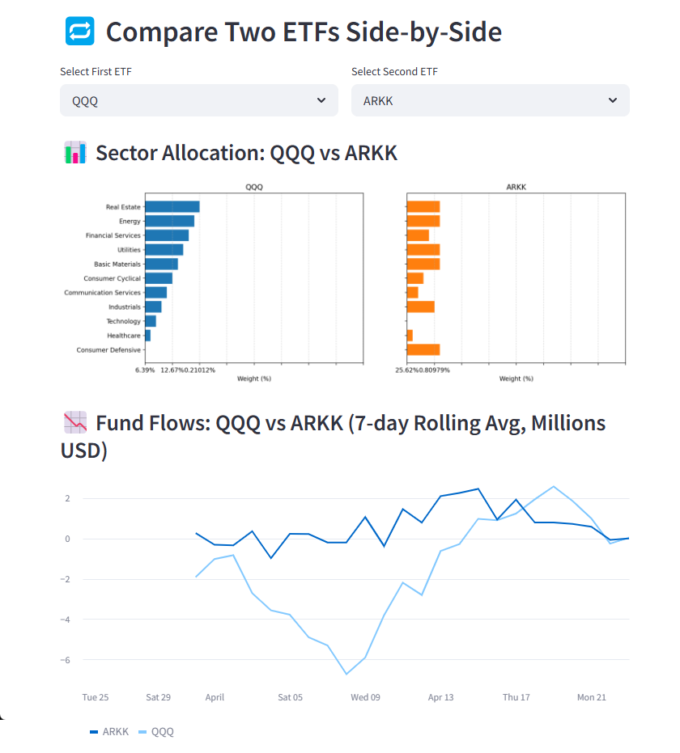

# 📈 ETF Flow Tracker

> Built and shipped in under 24 hours. This Streamlit dashboard pulls live ETF sector weightings and visualizes them with Bloomberg-inspired styling. Now with historical fund flow simulation, rolling averages, and ETF comparisons.



---

### 🔍 Features

- 📊 **Sector Allocation**: See the breakdown of top ETFs by sector
- 📉 **Fund Flows**: Visualize 30-day simulated net flows with 7-day rolling averages
- 🔁 **Comparison Mode**: Select two ETFs and compare side-by-side
- 💡 Built with Python, pandas, Streamlit, and matplotlib

---

### 📦 Tech Stack

- Python 3.11
- pandas, matplotlib
- Streamlit
- Synthetic financial data (for MVP)

---

### 🚀 Run Locally

```bash
git clone https://github.com/yourusername/etf-flow-tracker.git
cd etf-flow-tracker
pip install -r requirements.txt
streamlit run app/streamlit_app.py
